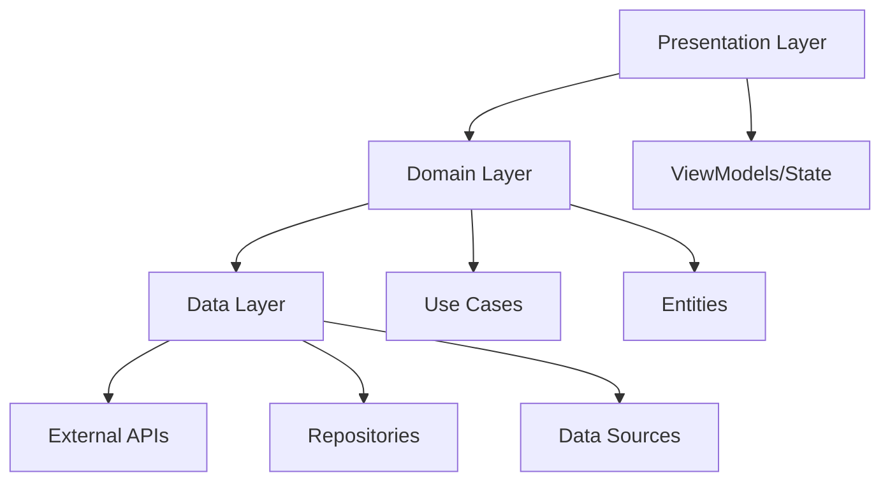

# Currency Converter

<div align="center">


_A modern, real-time currency converter built with Clean Architecture_

[Features](#-features) • [Quick Start](#-quick-start) • [Architecture](#-architecture) • [Documentation](#-documentation) • [Contributing](#-contributing)

</div>

---

## Overview

This Currency Converter is a Flutter application that provides real-time currency conversion between 35+ currencies. Built with Clean Architecture principles, MVVM pattern, and Riverpod state management for enterprise-grade scalability and maintainability.

### Key Highlights

- **Real-time Conversion**: Instant currency conversion as you type
- **35+ Currencies**: Comprehensive global currency support with visual flags
- **Live Exchange Rates**: Powered by ExchangeRate-API with automatic updates
- **Responsive Design**: Optimized for all screen sizes and orientations
- **Clean Architecture**: Scalable, testable, and maintainable codebase
- **Modern UI**: Material Design 3 with smooth animations and loading states

---

## Features

### Core Functionality

- **Instant Conversion** - Real-time calculation as you type
- **One-Tap Swap** - Reverse currencies with a single button press
- **Live Rates** - Automatic exchange rate updates
- **35+ Currencies** - Comprehensive global coverage
- **Visual Currency Flags** - Easy currency identification
- **Responsive Design** - Works perfectly on all devices

### Technical Excellence

- **Clean Architecture** - Domain-driven design with clear separation of concerns
- **MVVM Pattern** - Reactive state management with Riverpod
- **Secure Configuration** - Environment-based API key management
- **Smooth Animations** - Shimmer loading and fluid transitions
- **Comprehensive Testing** - Unit, widget, and integration tests
- **Performance Optimized** - Efficient API calls and state management

---

## Quick Start

### Prerequisites

Ensure you have these tools installed:

```bash
# Verify Flutter installation
flutter --version  # Should be 3.13.0+

# Verify Dart SDK
dart --version     # Should be 3.1.0+
```

### Setup & Installation

1. **Clone the repository**

   ```bash
   git clone https://github.com/iniisking/coinbox_test.git
   cd coinbox_test
   ```

2. **Install dependencies**

   ```bash
   flutter pub get
   ```

3. **Get your API key**

   - Register at [ExchangeRate-API](https://www.exchangerate-api.com/)
   - Verify your email and get your free API key
   - Copy your API key from the dashboard

4. **Configure environment**

   ```bash
   # Create environment file
   cp .env.example .env

   # Edit .env file and add your API key
   # EXCHANGE_RATE_API_KEY=your_actual_api_key_here
   ```

5. **Generate assets**

   ```bash
   # Generate asset references
   flutter pub run build_runner build --delete-conflicting-outputs
   ```

6. **Run the app**
   ```bash
   flutter run
   ```

### First Run Checklist

- [ ] API key is configured in `.env` file
- [ ] Internet connection is available
- [ ] Currency flag images are in `assets/images/`
- [ ] App initializes with SGD as default currency
- [ ] Exchange rates load successfully

---

## Architecture

### Project Structure

```
lib/
├──  core/                    # Shared application core
│   ├── constants/              # App-wide constants and configurations
│   │   ├── colors.dart         # Color palette and theming
│   │   ├── currencies.dart     # Supported currency definitions
│   │   └── env_constants.dart  # Environment variable keys
│   ├── errors/                 # Custom exceptions and error handling
│   ├── providers/              # Riverpod provider configurations
│   ├── utils/                  # Utility functions and helpers
│   └── widgets/                # Reusable UI components
│
├──  data/                    # Data layer - External interfaces
│   ├── datasources/            # API and external data sources
│   ├── models/                 # Data Transfer Objects (DTOs)
│   └── repositories/           # Repository implementations
│
├──  domain/                  # Business logic layer
│   ├── entities/               # Core business entities
│   ├── repositories/           # Abstract repository contracts
│   └── usecases/               # Business use cases and logic
│
└──  presentation/            # UI and state management
    ├── viewmodels/             # State management with Riverpod
    └── views/                  # UI screens and widgets
```

### Clean Architecture Flow



### Design Patterns Used

- **MVVM (Model-View-ViewModel)**: Separation of UI logic from business logic
- **Repository Pattern**: Abstraction over data sources
- **Dependency Injection**: Riverpod providers for loose coupling
- **Factory Pattern**: Object creation and configuration
- **Observer Pattern**: Reactive state management

---

## Technical Stack

### Core Framework

- **Flutter 3.13.0+** - Cross-platform UI framework
- **Dart 3.1.0+** - Programming language with null safety

### State Management & Architecture

- **Riverpod 2.4.0** - Reactive state management solution
- **Equatable** - Value-based equality comparisons
- **Meta** - Annotations for better code analysis

### Networking & APIs

- **HTTP** - API communication
- **ExchangeRate-API** - Real-time exchange rate data

### UI & User Experience

- **ScreenUtil** - Responsive design utilities
- **Shimmer** - Loading animation effects
- **Material Design 3** - Modern UI components

### Configuration & Environment

- **Flutter Dotenv** - Environment variable management
- **Build Runner** - Code generation and asset handling

### Internationalization

- **Intl** - Internationalization and localization support

---

## User Experience

### App Flow

1. **Launch & Initialization**

   - App starts with elegant splash screen
   - Loads environment configuration
   - Fetches initial exchange rates for SGD (default)
   - Shows shimmer loading during data fetch

2. **Currency Conversion**

   - Enter amount in either input field
   - Conversion happens instantly as you type
   - Visual feedback with smooth animations
   - Exchange rate indicator updates in real-time

3. **Currency Selection**

   - Tap currency dropdown to see all options
   - Visual currency flags for easy identification
   - Alphabetically sorted currency list
   - Auto-update rates when base currency changes

4. **Currency Swapping**
   - One-tap currency reversal with swap button
   - Amounts are preserved and recalculated
   - Smooth animation during swap operation
   - New exchange rates fetched automatically

### UI Components

#### Custom Widgets

- **CustomTextWidget**: Consistent typography system
- **AuthTextFormField**: Input fields with validation
- **CurrencyDropdown**: Currency selection with flags
- **ShimmerLoaders**: Beautiful loading states

#### Color System

```dart
// Primary colors
backgroundColor1, backgroundColor2  // Gradient backgrounds
headerTextColor                    // Primary text
regularTextColor                   // Secondary text
buttonColor                        // Interactive elements
dividerColor                       // Section separators
iconColor                          // Icons and accents
```

---

## API Integration

### ExchangeRate-API Configuration

**Base URL**: `https://v6.exchangerate-api.com/v6/`

**Endpoints Used**:

```http
GET /v6/{API_KEY}/latest/{BASE_CURRENCY}
```

**Request Example**:

```bash
curl "https://v6.exchangerate-api.com/v6/your-api-key/latest/SGD"
```

**Response Format**:

```json
{
  "result": "success",
  "documentation": "https://www.exchangerate-api.com/docs",
  "terms_of_use": "https://www.exchangerate-api.com/terms",
  "time_last_update_unix": 1694208001,
  "time_last_update_utc": "Fri, 08 Sep 2023 00:00:01 +0000",
  "time_next_update_unix": 1694294401,
  "time_next_update_utc": "Sat, 09 Sep 2023 00:00:01 +0000",
  "base_code": "SGD",
  "conversion_rates": {
    "USD": 0.7367,
    "EUR": 0.6845,
    "GBP": 0.5892,
    "JPY": 108.45,
    "CNY": 5.2341
    // ... 160+ more currencies
  }
}
```

### Error Handling

The app gracefully handles various API scenarios:

- **Network Errors**: Connection timeout, no internet
- **API Errors**: Invalid API key, rate limit exceeded
- **Data Errors**: Malformed response, missing currencies
- **User Feedback**: Clear error messages and retry options

---

## Testing Strategy

### Test Categories

```bash
# Run all tests
flutter test

# Run with coverage
flutter test --coverage

# Run specific test suites
flutter test test/unit/
flutter test test/widget/
flutter test test/integration/
```

### Test Coverage

- **Unit Tests**: Business logic, calculations, utilities
- **Widget Tests**: UI components, user interactions
- **Integration Tests**: API calls, data flow, state management
- **Golden Tests**: UI consistency across platforms

### Testing Tools

- **Flutter Test**: Built-in testing framework
- **Mockito**: Mocking dependencies
- **Golden Toolkit**: Screenshot testing
- **Integration Test**: End-to-end testing

---

## Security & Configuration

### Environment Variables

```env
# Required - Your ExchangeRate-API key
EXCHANGE_RATE_API_KEY=your_actual_api_key_here

# Optional - API configuration
API_BASE_URL=https://v6.exchangerate-api.com/v6/
REQUEST_TIMEOUT=30
```

### Security Best Practices

- ✅ Environment variables for sensitive data
- ✅ API key validation on startup
- ✅ Request timeout configuration
- ✅ Error message sanitization
- ✅ No hardcoded secrets in source code

### Production Deployment

For production environments, configure secrets via:

- **Firebase**: Environment configuration
- **AWS**: Systems Manager Parameter Store
- **Google Cloud**: Secret Manager
- **Vercel/Netlify**: Environment variables
- **CI/CD**: Encrypted environment variables

---

## Build & Deployment

### Development Builds

```bash
# Debug build (development)
flutter run --debug

# Profile build (performance testing)
flutter run --profile

# Hot reload during development
flutter run --hot
```

### Production Builds

```bash
# Android APK
flutter build apk --release --target-platform android-arm64

# Android App Bundle (recommended for Play Store)
flutter build appbundle --release

# iOS Archive
flutter build ios --release

# Web Application
flutter build web --release --web-renderer canvaskit
```

### Build Optimization

- **Code Splitting**: Lazy loading for better performance
- **Asset Optimization**: Compressed images and fonts
- **Tree Shaking**: Remove unused code in release builds
- **Minification**: Optimized Dart and JavaScript output

---

## Contributing

We welcome contributions from the developer community! Here's how you can help:

### Development Workflow

1. **Fork** the repository
2. **Clone** your fork locally
3. **Create** a feature branch: `git checkout -b feature/amazing-feature`
4. **Develop** your feature following our coding standards
5. **Test** your changes thoroughly
6. **Commit** with descriptive messages: `git commit -m 'Add amazing feature'`
7. **Push** to your branch: `git push origin feature/amazing-feature`
8. **Submit** a pull request with detailed description

### Coding Standards

- **Dart Style Guide**: Follow official Dart conventions
- **Clean Architecture**: Maintain separation of concerns
- **Documentation**: Comment complex logic and public APIs
- **Testing**: Write tests for new functionality
- **Performance**: Consider performance implications

### Areas for Contribution

- **Bug Fixes**: Report and fix issues
- **Feature Development**: Implement new capabilities
- **Documentation**: Improve guides and examples
- **Testing**: Increase test coverage
- **UI/UX**: Enhance user experience
- **Localization**: Add language support

---

## Troubleshooting

### Common Issues & Solutions

#### API Key Problems

```bash
# Issue: "Invalid API key" error
# Solution: Verify your API key in .env file
grep EXCHANGE_RATE_API_KEY .env

# Issue: API key not loading
# Solution: Ensure .env is in root directory and properly formatted
```

#### Build Failures

```bash
# Issue: Asset generation fails
# Solution: Clean and regenerate assets
flutter clean
flutter pub get
flutter pub run build_runner build --delete-conflicting-outputs

# Issue: Dependency conflicts
# Solution: Update pubspec.yaml and resolve conflicts
flutter pub deps
flutter pub upgrade
```

#### Runtime Errors

```bash
# Issue: Network connectivity problems
# Solution: Check internet connection and API status
ping exchangerate-api.com

# Issue: Currency flag images missing
# Solution: Verify assets are in correct directory
ls assets/images/*.png
```

### Debug Tools

- **Flutter Inspector**: UI debugging and performance
- **DevTools**: Network monitoring and memory profiling
- **Dart Observatory**: Runtime analysis and debugging
- **VS Code Debugger**: Breakpoints and variable inspection

---

### Data Privacy

- No personal data is collected or stored
- API calls are made securely over HTTPS
- Currency conversion data is processed locally

---

### Developer Resources

- **API Documentation**: [ExchangeRate-API Docs](https://www.exchangerate-api.com/docs)
- **Flutter Guides**: [Flutter.dev](https://docs.flutter.dev/)
- **Riverpod Docs**: [Riverpod.dev](https://riverpod.dev/)

---

<div align="center">

[](https://flutter.dev)
[](https://dart.dev)

</div>
